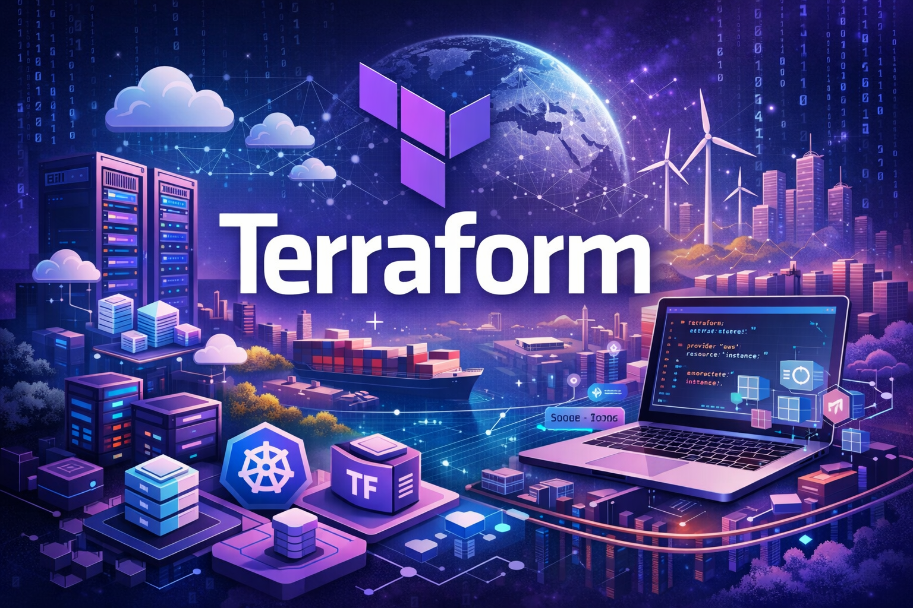

# AWS Infrastructure Tiers



Production-ready Terraform modules demonstrating three deployment strategies on AWS -- from traditional EC2 to containerized ECS Fargate to fully serverless. Each tier is self-contained and deploys a complete backend stack with VPC, database, and compute.

```
                    ┌─────────────────────────────────────────────┐
                    │           AWS Infrastructure Tiers          │
                    └─────────────────────────────────────────────┘

  Tier 1: EC2              Tier 2: ECS Fargate         Tier 3: Serverless
  ──────────────           ──────────────────          ──────────────────
  ┌──────────┐             ┌──────────┐                ┌──────────┐
  │   ALB    │             │ ECS      │                │ API GW   │
  └────┬─────┘             │ Cluster  │                └────┬─────┘
       │                   └────┬─────┘                     │
  ┌────┴─────┐             ┌────┴─────┐                ┌────┴─────┐
  │ EC2  EC2 │             │ Fargate  │                │  Lambda  │
  │ inst inst│             │  Tasks   │                │ Functions│
  └────┬─────┘             └────┬─────┘                └────┬─────┘
       │                        │                           │
  ┌────┴─────┐             ┌────┴─────┐                ┌────┴─────┐
  │ RDS PG   │             │ RDS PG   │                │  Aurora  │
  │ (t3.mic) │             │ (t3.mic) │                │Serverless│
  └──────────┘             └──────────┘                └──────────┘
```

## Tier Comparison

| | Tier 1: EC2 | Tier 2: ECS Fargate | Tier 3: Serverless |
|---|---|---|---|
| **Compute** | EC2 instances + ALB | Fargate containers | Lambda + API Gateway |
| **Database** | RDS PostgreSQL | RDS PostgreSQL | Aurora Serverless v2 |
| **Networking** | VPC + NAT Gateway | VPC + VPC Endpoints (no NAT) | VPC (private subnets only) |
| **Scaling** | Manual / ASG | ECS service scaling | Automatic (Lambda concurrency) |
| **Cost Profile** | Fixed (instances always on) | Pay per container runtime | Pay per request |
| **Best For** | Full OS control, legacy apps | Containerized microservices | Event-driven APIs, variable traffic |
| **Complexity** | Low | Medium | Medium |

## Structure

```
├── tier-1-ec2/                  # Traditional EC2 deployment
│   └── modules/
│       ├── vpc/                 # VPC, subnets, IGW, NAT Gateway
│       ├── rds/                 # PostgreSQL RDS in private subnets
│       └── webserver/           # EC2 instances + ALB
│
├── tier-2-ecs-fargate/          # Containerized ECS deployment
│   └── modules/
│       ├── vpc/                 # VPC with VPC Endpoints (no NAT)
│       ├── security_groups/     # ECS task security groups
│       ├── iam/                 # Task execution roles + SSM access
│       ├── rds/                 # PostgreSQL RDS
│       └── ecs/                 # Cluster, task definitions, services
│
├── tier-3-serverless/           # Serverless deployment
│   └── modules/
│       ├── vpc/                 # Minimal VPC for DB connectivity
│       ├── api_gateway/         # HTTP API Gateway
│       ├── lambda/              # Lambda functions with VPC access
│       └── rds/                 # Aurora Serverless v2
│
└── shared/                      # S3 backend config example
```

## Prerequisites

- [Terraform](https://www.terraform.io/downloads) >= 1.2.0
- [AWS CLI](https://aws.amazon.com/cli/) configured with credentials
- An AWS account with permissions for VPC, EC2, RDS, ECS, Lambda, API Gateway, IAM

## Usage

Each tier is independent. Navigate to the desired tier and run:

```bash
cd tier-1-ec2    # or tier-2-ecs-fargate, tier-3-serverless

terraform init
terraform plan -var="db_user_name=admin" -var="db_user_password=securepassword"
terraform apply
```

Use a `terraform.tfvars` file for variable management:

```hcl
project_name     = "myapp"
environment      = "production"
db_user_name     = "admin"
db_user_password = "securepassword"
```

## Design Decisions

**Tier 1** uses a NAT Gateway for private subnet outbound access -- the standard approach when instances need to pull updates or reach external APIs.

**Tier 2** replaces the NAT Gateway with VPC Endpoints for AWS services (ECS, ECR, CloudWatch, SSM, S3). This eliminates the ~$32/month NAT Gateway cost while maintaining private subnet isolation. Secrets are managed through AWS Systems Manager Parameter Store with scoped IAM policies.

**Tier 3** uses Aurora Serverless v2 which scales capacity automatically (0.5 to 4 ACUs) and pairs naturally with Lambda's pay-per-invocation model. The VPC contains only private subnets since neither Lambda nor Aurora need public internet access.

## License

MIT
